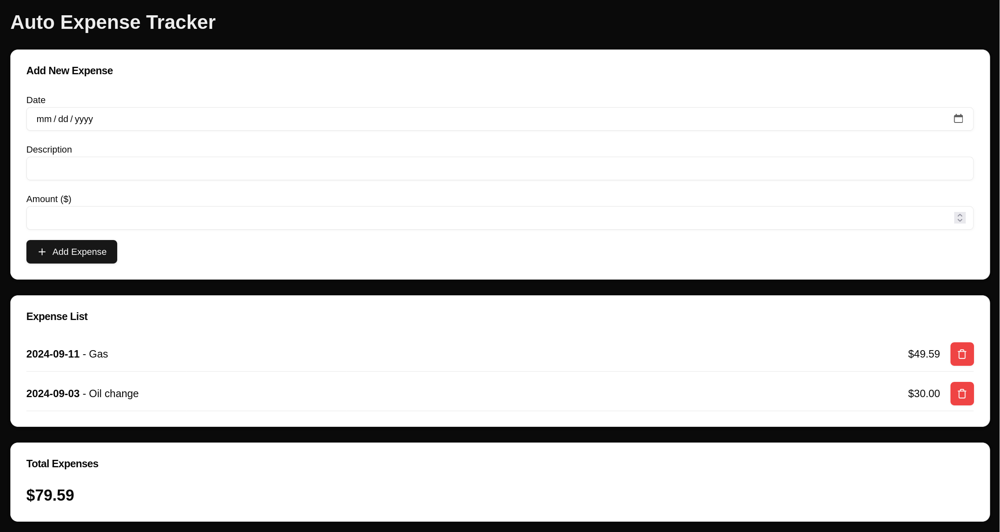

# Auto Expense Tracker

## Notes

- [v0](https://v0.dev/chat) Prompt: "Generate a NextJS frontend application that tracks a user's automotive expenses"
- Code generated by v0: `./auto-expense-tracker/app/page.tsx`

### Project setup

```sh
npx create-next-app@latest auto-expense-tracker
npm install lucide-react
npx shadcn@latest init
npx shadcn@latest add button
npx shadcn@latest add input
npx shadcn@latest add label
npx shadcn@latest add card
npm run dev
```

## Screenshot


